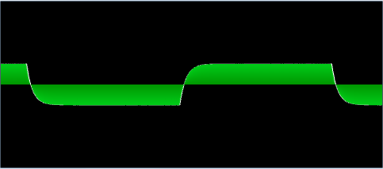

SoundSynth
==========

A simple synthesizer implementing a lowpass filter in sfml. (Made for azerty keyboard originally, change main.cpp if you want to modify the key mapping.)

# How to build

Get [SFML2.0](http://sfml-dev.org/)

Link with -lsfml-audio -lsfml-graphics -lsfml-window -lsfml-system

# Screenshot

